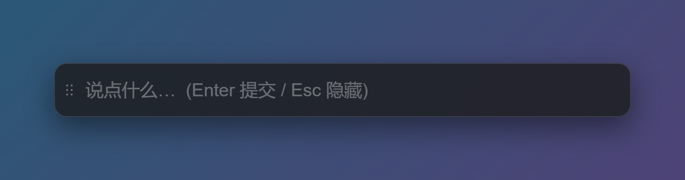
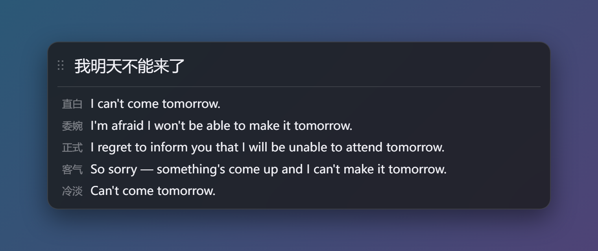
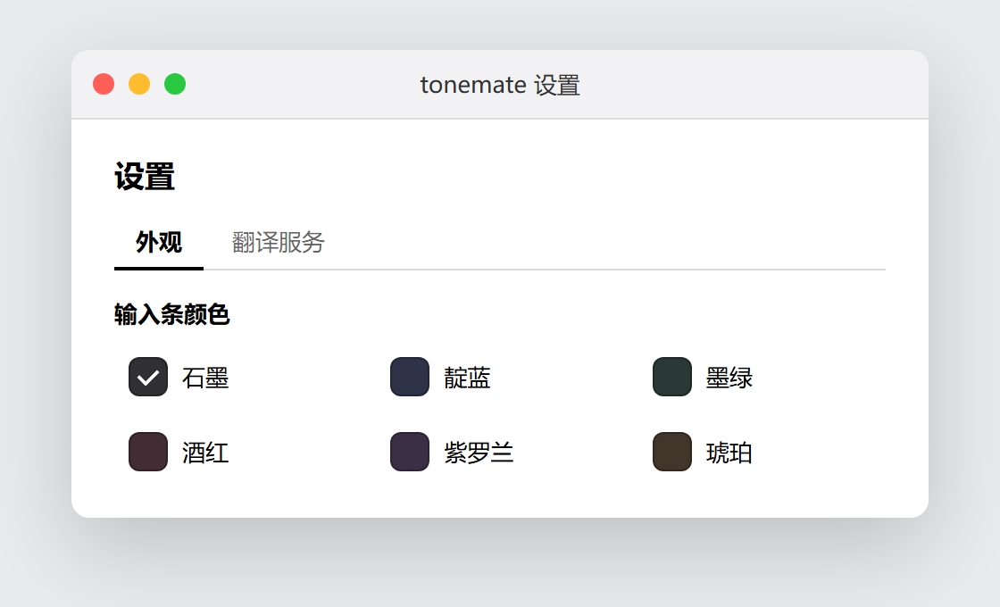
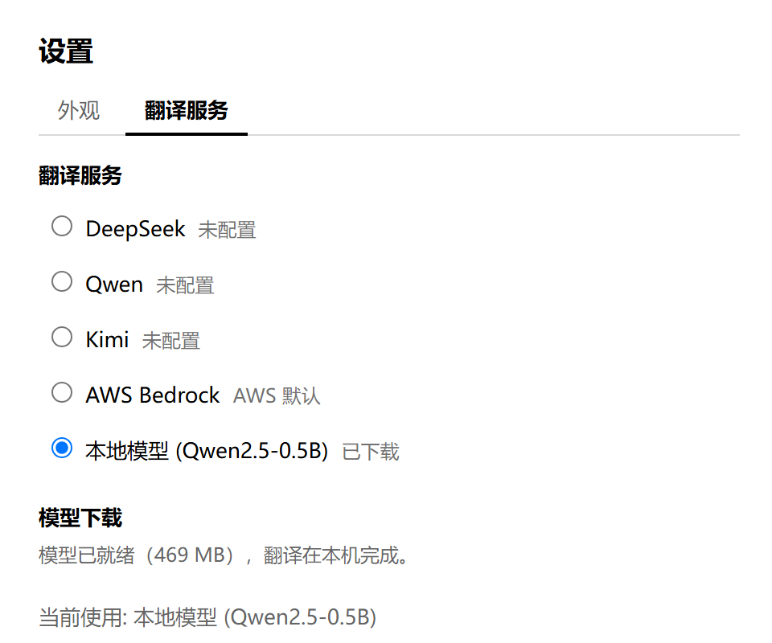

# tonemate

[English](README.en.md) · 简体中文

> 按下快捷键，输入一句话，立刻得到同一句话的几种不同「语气」的翻译版本，挑最合适的那条发出去。


## 这是什么？

tonemate 是一个常驻在菜单栏（Windows / Linux 上是系统托盘）里的翻译小工具。它平时不占地方，需要时按一下快捷键，就能在你正在用的任何软件里呼出一个输入条：

1. 输入一句话，回车；
2. 它把这句话翻译成 3~5 个不同语气的版本，逐行「流」出来，每一行都标注了语气（直白、委婉、正式、客气……）；
3. 根据发给谁来挑最合适的一条，点一下就能复制。

翻译方向会自动判断：

- 输入**中文** → 翻译成**英文**；
- 输入**英文** → 翻译成**中文**；
- 输入其他语言 → 翻译成**英文**。

第一行永远是最贴近字面、最中性的版本，后面的行语气渐远，方便你对比着选。

## 界面预览

| 输入条 | 多语气翻译结果 |
| --- | --- |
|  |  |

| 配色选择 | 翻译服务配置 |
| --- | --- |
|  |  |

## 安装

从 [Releases](https://github.com/shlouai/tonemate/releases) 下载最新版（当前 v0.1.0）：

| 平台 | 安装包 | 说明 |
| --- | --- | --- |
| macOS | `tonemate_0.1.0_universal.dmg` | 双击 DMG，把 tonemate 拖进「应用程序」 |
| macOS（免安装） | `tonemate_0.1.0_universal.app.zip` | 解压后直接运行 tonemate.app |
| Windows | `tonemate_0.1.0_x64-setup.exe` | 运行安装程序，装好后从开始菜单 / 桌面启动 |
| Windows（绿色版） | `tonemate_0.1.0_x64_portable.zip` | 解压后双击 tonemate.exe 即用 |

macOS 的 universal 包同时支持 Intel 和 Apple Silicon；Windows 版本依赖 WebView2 运行时（Win10/11 一般已随 Edge 预装）。

> **macOS 首次打开**：应用未签名，Gatekeeper 会拦截。右键点 app →「打开」，或在「系统设置 → 隐私与安全性」里点「仍要打开」，之后即可正常启动。

release 里附带了 `SHA256SUMS.txt`，可用于校验下载完整性。

启动后窗口是隐藏的，只有菜单栏 / 托盘里多出一个图标——按下快捷键即可呼出输入条（见下一节）。

## 怎么用？

### 从源码运行（开发者）

想自己改代码、从源码跑，而不是用上面的安装包：

```sh
pnpm install
pnpm tauri dev
```

启动后窗口是隐藏的，只有菜单栏 / 托盘里多出一个图标。看到终端打印 `[tonemate] hotkey registered: ...` 就说明可以用了。

### 呼出输入条

| 操作 | 说明 |
| --- | --- |
| `Cmd+Shift+Space`（macOS）<br>`Ctrl+Shift+Space`（Windows / Linux） | 呼出输入条；再按一次收起 |
| `Enter` | 翻译，输入条保持打开，下方显示结果 |
| `Esc` | 收起并清空结果 |

### 输入、翻译、复制

呼出输入条后直接打字，回车翻译。结果会一行一行实时出现；**点任意一行**即可把该行（不含语气标签）复制到剪贴板。

点击菜单栏 / 托盘图标会弹出一个菜单：呼出输入条、打开设置、退出。

## 设置

点击图标 → **设置…** 打开设置窗口，有两个面板：

- **外观**：更换输入条颜色（石墨 / 靛蓝 / 墨绿 / 酒红 / 紫罗兰 / 琥珀），选完立刻生效。
- **翻译服务**：选择翻译服务，并填上对应的密钥。

## 翻译服务

tonemate 默认使用 **AWS Bedrock**；你也可以在设置里切换成别的服务：

| 服务 | 需要什么 |
| --- | --- |
| AWS Bedrock | 默认。需要本机已配置能调用 Bedrock 的 AWS 凭证 |
| DeepSeek | 一个 API Key（[platform.deepseek.com](https://platform.deepseek.com)） |
| Qwen | 一个 API Key（[百炼 / 阿里云 Model Studio](https://www.alibabacloud.com/help/en/model-studio)） |
| Kimi | 一个 API Key（[platform.moonshot.cn](https://platform.moonshot.cn)） |

选了 Kimi / DeepSeek / Qwen 但还没填 Key 时，会自动退回 Bedrock，并在日志里说明；如果填了 Key 但被服务拒绝，则会直接报错，而不是悄悄退回 Bedrock 继续给你计费。

### 本地模型（离线翻译）

在 设置 → 翻译服务 中选择「本地模型 (Hy-MT2)」即可离线翻译，文本不离开本机。
首次选择会自动下载约 440 MB 的模型（通过 `hf-mirror.com` 镜像）；下载支持断点续传。
翻译在本机通过 llama.cpp 运行，首次翻译时会自动准备运行时（约几秒）。模型和运行时都自带镜像回退——官方源无法访问时自动换用镜像，无需手动配置。

默认仍是 AWS Bedrock；未选择本地模型时不会下载任何东西。

可用环境变量：

| 变量 | 默认值 | 说明 |
| --- | --- | --- |
| `TONEMATE_LOCAL_MODEL_URL` | 内置镜像 URL | 覆盖模型下载地址 |
| `TONEMATE_LLAMA_SERVER_URL` | llama.cpp b10936 发布地址 | 覆盖运行时下载地址（可选；默认已自动尝试镜像） |
| `TONEMATE_LOCAL_PORT` | `8931` | llama-server 端口 |
| `TONEMATE_LOCAL_N_GPU_LAYERS` | `0` | GPU 卸载层数，0 = 仅 CPU |

---

## 进阶（开发者 / 深度配置）

> 普通用户到这里就可以停了。下面的内容给想自己构建、或想微调模型参数的人。

### 构建可执行文件

```sh
pnpm tauri build
```

### 命令行直接翻译（不打开图形界面）

想绕过界面、直接测试翻译链路（比如检查凭证、或给模型切换计时）：

```sh
cd src-tauri
cargo run --example translate -- "今天天气不错，我们出去走走吧。"
```

它会打印原始输出流、解析出的每个语气版本，以及「首字耗时 / 总耗时」。这个例子默认用 Bedrock；想指定服务，设置 `TONEMATE_KIMI_API_KEY` / `TONEMATE_DEEPSEEK_API_KEY` / `TONEMATE_QWEN_API_KEY` 其中之一即可。

### 环境变量

设置窗口只保存「属于使用者本人」的那几项（颜色、服务、Key、AWS Profile），并即时生效。其余全部通过环境变量配置，均为可选，未设置时使用下表默认值。

| 变量 | 默认值 | 适用服务 |
| --- | --- | --- |
| `TONEMATE_AWS_PROFILE` | — | Bedrock |
| `TONEMATE_AWS_REGION` | `us-west-2` | Bedrock |
| `TONEMATE_MODEL` | `us.anthropic.claude-opus-5` | Bedrock |
| `TONEMATE_EFFORT` | `low` | Bedrock |
| `TONEMATE_KIMI_BASE_URL` | `https://api.moonshot.cn/v1` | Kimi |
| `TONEMATE_KIMI_MODEL` | `kimi-k2.6` | Kimi |
| `TONEMATE_DEEPSEEK_BASE_URL` | `https://api.deepseek.com/v1` | DeepSeek |
| `TONEMATE_DEEPSEEK_MODEL` | `deepseek-chat` | DeepSeek |
| `TONEMATE_QWEN_BASE_URL` | `https://dashscope.aliyuncs.com/compatible-mode/v1` | Qwen |
| `TONEMATE_QWEN_MODEL` | `qwen3.7-plus` | Qwen |

几点要注意的：

- **Bedrock 模型**：Bedrock 只通过跨区域推理 Profile 提供 Claude 5 系列，所以 `TONEMATE_MODEL` 需要 `us.` 前缀——裸的 `anthropic.claude-opus-5` 会被拒绝。把 `TONEMATE_EFFORT` 设为空字符串可以彻底去掉 effort 参数，从而让模型指向 Haiku 4.5 之类不接受该参数的模型：

  ```sh
  TONEMATE_MODEL=us.anthropic.claude-haiku-4-5-20251001-v1:0 TONEMATE_EFFORT= pnpm tauri dev
  ```

- **Kimi**：Moonshot 有国内站（`api.moonshot.cn`）和国际站（`api.moonshot.ai`），一个站发的 Key 在另一个站会返回 `401`，而 Key 本身看不出属于哪个站——所以 `401` 通常意味着 `TONEMATE_KIMI_BASE_URL` 填错了。模型请保持 `kimi-k2.6`：它是唯一能关掉推理的 Kimi 模型；`kimi-k2.7-code` 会拒绝 `thinking: disabled`，直接失败。

- **DeepSeek**：请保持 `deepseek-chat`（非推理模型）。`deepseek-reasoner` 是推理模型，会耗尽预算、不给翻译。

- **Qwen**：同样分国内站（`dashscope.aliyuncs.com`）和国际站（`dashscope-intl.aliyuncs.com`），Key 用错站会 `401`。模型默认 `qwen3.7-plus`；无论选哪个，思考都要关掉（应用已发 `enable_thinking: false`），否则会先推理约 21 秒。

### 设置存到哪了？

设置保存在 `~/Library/Application Support/com.tonemate.app/settings.json`（Windows 在 `%APPDATA%\com.tonemate.app\settings.json`，Linux 在 `~/.config/com.tonemate.app/settings.json`），重启后依然生效。**API Key 以明文存在这个文件里**，任何以你身份运行的程序都能读到；文件被写成仅属主可读，但这只是「减速带」，不是真正的保护。

### 推荐 IDE

[VS Code](https://code.visualstudio.com/) + [Tauri](https://marketplace.visualstudio.com/items?itemName=tauri-apps.tauri-vscode) + [rust-analyzer](https://marketplace.visualstudio.com/items?itemName=rust-lang.rust-analyzer)
